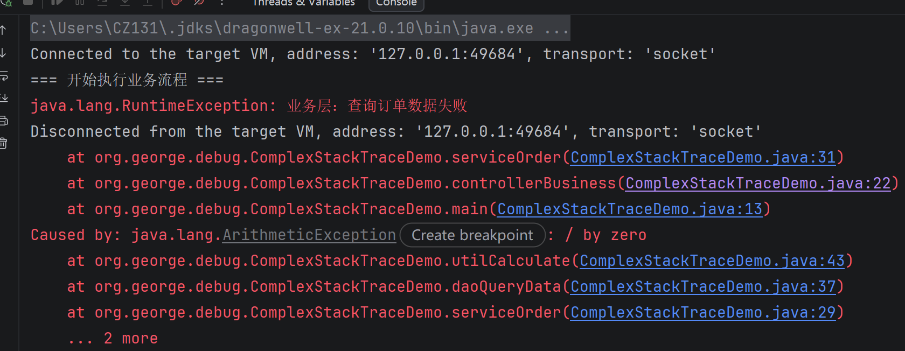
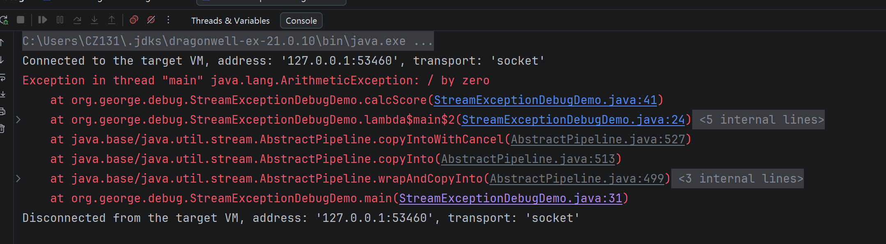
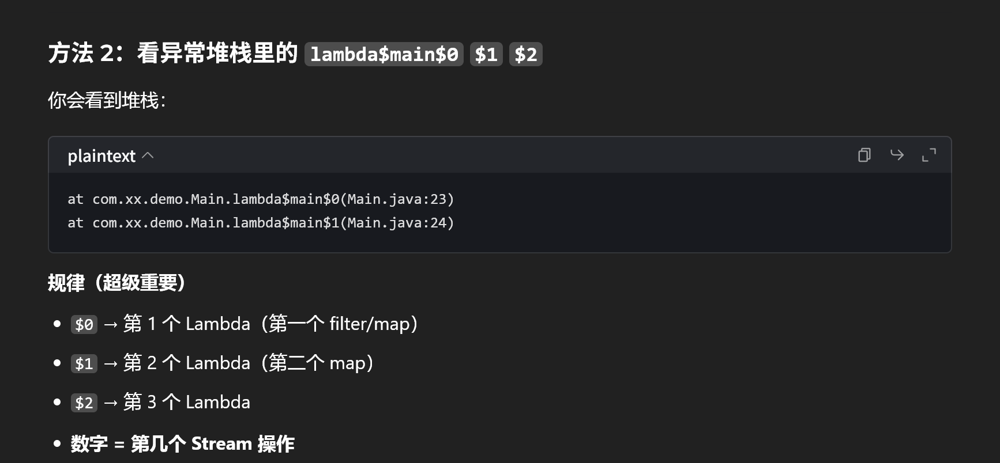
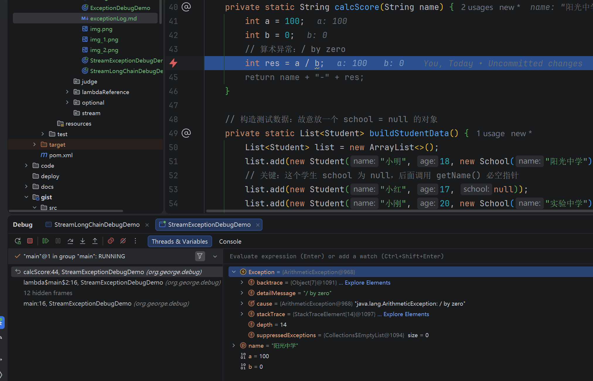
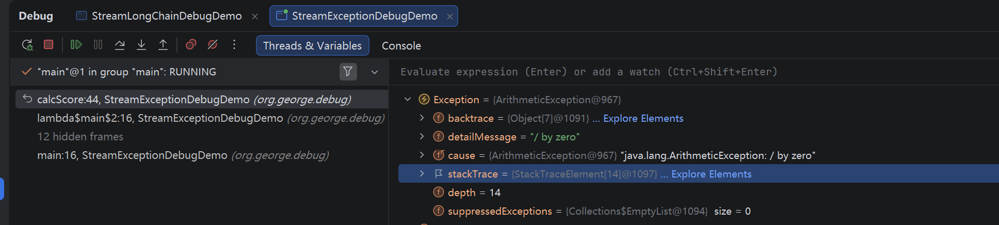
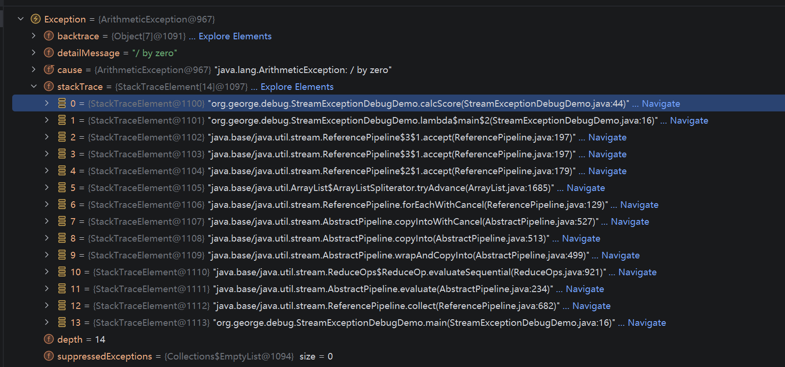
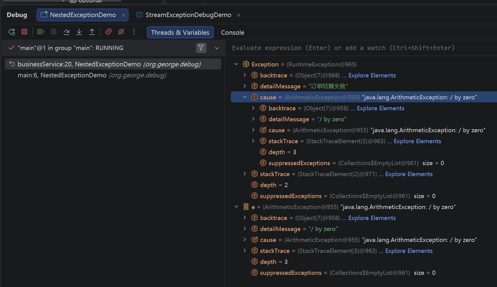

## 异常日志
根源异常和包装异常，将异常日志分为多段
手动嵌套包装异常导致堆栈分层成两段。
caused by 包装异常中的 e 是根源异常中信息，也就是这些分段的界限
根源日志的从下往上看最后一行就是catch中重新包装的异常抛出，第一行就是包装日志的最后一行的catch匹配
的try语块调用.相当于异常日志模块从下往上是try ---> catch ---> catch
也可以理解为 从下往上，每段日志从从上往下连着，调用栈的顺序

### 异常日志阅读
异常类型 异常原因
从下往上看，第一行调用处
从下往上看，最后一行,底层框架jdk报错，真正报错地方

### stream流异常



anyException自动定位
stream流的堆栈信息
代码内断点：ctrl + F8:代码里面出现一个小红点，不是在行号栏，是嵌在代码里。

F8从filter ---> map F7进入方法
走到异常的那一步之后，继续F8程序结束，进入console
### 异常堆栈信息解读

这是 IDEA 调试窗口里，**Java 异常对象（`ArithmeticException`）的内部结构视图**，我给你逐行拆解，你一看就懂：

---

### 一、整体说明
这是一个 **`java.lang.ArithmeticException`（算术异常）** 的实例，IDEA 自动帮你把异常对象里的所有字段都展开了，你看到的每一行都是异常对象的一个属性。

---

### 二、逐行拆解每个字段
1.  **`Exception = {ArithmeticException@967}`**
    表示当前对象是一个 `ArithmeticException`（除0错误）实例，`@967` 是它在内存中的地址标识。

2.  **`backtrace = {Object[7]@1091}`**
    这是 JVM 底层用来记录异常调用栈的数组，一般调试时我们不直接用它，IDEA 会帮我们把栈信息整理成 `stackTrace`。

3.  **`detailMessage = "/ by zero"`**
    异常的**详细错误信息**。这里明确告诉你：这是“除以零”的算术异常，和你代码里 `100 / 0` 的错误完全对应。

4.  **`cause = {ArithmeticException@967}`**
    这是**异常的根因（cause）**，表示这个异常是被另一个异常包装的。
    这里它自己指向自己，说明这是一个**没有被包装过的原生异常**，没有嵌套其他根因。

5.  **`stackTrace = {StackTraceElement[14]@1097}`**
    这是你最关心的**异常调用栈信息**，由 14 个 `StackTraceElement` 对象组成。
    点击 `Explore Elements` 就能展开，里面就是我们平时打印的异常堆栈（比如 `at com.xxx.xxx(xxx.java:行号)`），能精准定位到出错的代码位置。

6.  **`depth = 14`**
    表示这个异常的调用栈深度是 14 层，和上面 `stackTrace` 数组的长度对应。

7.  **`suppressedExceptions = {Collections$EmptyList@1094} size = 0`**
    这是 Java 的“被抑制异常”列表（try-with-resources 语法里用的），这里 size=0 表示当前没有被抑制的异常。

---

### 三、结合你 Stream 调试的关键用法
在 IDEA 调试中，你只要记住这 3 个核心字段就够了：
1.  **`detailMessage`**：一眼知道是什么错误（比如 `NullPointerException` 还是 `/ by zero`）
2.  **`stackTrace`**：点击展开，找到第一个你的代码行，就是出错的位置
3.  **`cause`**：如果是嵌套异常，这里会指向真正的根因异常

---

### 四、小补充：和控制台打印的对应关系
控制台里的：
```
java.lang.ArithmeticException: / by zero
    at com.xxx.xxx.xxx(xxx.java:123)
```
完全就是从这个对象里读出来的：
- `java.lang.ArithmeticException: / by zero` → 来自 `detailMessage`
- 下面的 `at ...` 调用栈 → 来自 `stackTrace` 数组


我来分两部分给你讲清楚，先教你怎么通过 `stackTrace` 跳转到出错代码，再解答你关于 `cause` 的疑问。

---

## 一、手把手教你：通过 `stackTrace` 直接跳转到出错代码
这是 IDEA 调试里超实用的功能，跟着做就行：

### 1. 找到 `stackTrace` 字段
就是你截图里高亮的这一行：
```
stackTrace = {StackTraceElement[14]@1097} ... Explore Elements
```

### 2. 点击 `Explore Elements` 链接
点一下蓝色的 `Explore Elements`，会弹出一个窗口，里面列出了完整的调用栈。
你会看到一堆这样的元素：
```
StackTraceElement@xxxx: "com.your.demo.StreamDemo.calcScore(StreamDemo.java:43)"
StackTraceElement@xxxx: "com.your.demo.StreamDemo.lambda$main$2(StreamDemo.java:25)"
...
```

### 3. 找到**第一个你自己写的代码行**
- 跳过所有 `java.base`、`java.util.stream` 开头的系统类，直接找你自己的包名（比如 `org.george.debug`）
- 最上面的那个，就是**真正抛出异常的代码位置**

### 4. 双击它，直接跳转到代码行
双击这一行，IDEA 会自动帮你打开对应的文件，并定位到出错的那一行，比如 `calcScore` 里 `100 / 0` 的位置。

---

## 二、为什么 `cause` 和 `Exception` 本身的信息一样？
你截图里看到的：
```
Exception = {ArithmeticException@967}
cause = {ArithmeticException@967}
```
这两个是**同一个对象**，不是多余，而是 Java 异常设计的特殊规则。

### 1. 先搞懂 `cause` 是干嘛的
`cause` 是用来表示**“导致当前异常的根本原因”**的字段。
比如业务层包装异常时：
```java
try {
    daoQuery();
} catch (Exception e) {
    // 这里的 e 就是原始异常，会被设置为新异常的 cause
    throw new RuntimeException("业务层失败", e);
}
```
这时新的 `RuntimeException` 的 `cause`，就会指向底层的原始异常 `e`，这样你才能在日志里看到 `Caused by: ...`。

### 2. 为什么你的 `cause` 和 `Exception` 是同一个？
Java 有一个**安全机制**：**异常的 cause 不能被设置为自己**，否则会导致无限递归（死循环）。
所以，当一个异常是**原生抛出、没有被包装过**的时候，它的 `cause` 字段默认会指向它自己。

### 3. 你现在的情况就是这样：
你截图里的 `ArithmeticException` 是代码直接抛出的原始异常，没有被 `try-catch` 再包装一层，所以：
- `Exception` 本身：`ArithmeticException: / by zero`
- `cause`：也指向这个 `ArithmeticException` 对象

### 4. 什么时候会不一样？
当异常被包装过之后，`cause` 就会指向真正的根因。比如：
```java
RuntimeException 业务异常: "查询订单失败"
    └─ cause: ArithmeticException: / by zero  ← 这里就不一样了
```
这时你在调试里看到的就是：
- 外层 `Exception` 是 `RuntimeException`
- `cause` 是 `ArithmeticException`

---

## 一句话总结
- 直接抛出的原生异常：`cause` 默认指向自己，看起来“重复”，但这是 Java 防止递归的安全设计。
- 被包装过的异常：`cause` 会指向真正的根因异常，是排查问题的关键。

要不要我给你一段包装异常的代码，你 Debug 一下，看看 `cause` 和 `Exception` 不一样的效果？

来！我给你把这张图拆解得明明白白，顺便把之前讲的所有原理串起来，你看完就彻底通透了。

---

## 一、先看整体结构：两层异常，清清楚楚
你截图里有两个异常对象，是**包装与被包装**的关系：

1.  **最外层：`Exception = {RuntimeException@965}`**
    - 类型：`RuntimeException`
    - 信息：`detailMessage = "订单结算失败"`
    - 这是你代码里业务层抛出来的“包装异常”，给用户看的友好提示。

2.  **被它包裹的：`cause = {ArithmeticException@955}`**
    - 类型：`ArithmeticException`
    - 信息：`detailMessage = "/ by zero"`
    - 这是真正的“病根”，是底层 `daoLayer()` 里 `100 / 0` 直接抛出的原始异常。

3.  下面还有个 `e = {ArithmeticException@955}`，和 `Exception.cause` 是同一个对象（内存地址都是 `@955`），也就是你 `catch` 到的原始异常。

---

## 二、逐行拆解每个字段的含义
我先讲通用规则，再套进你的图里：

### 1. `detailMessage`：一句话说明“是什么错误”
- 外层 `RuntimeException`：`"订单结算失败"`（业务提示）
- 内层 `ArithmeticException`：`"/ by zero"`（真实错误原因）
- 这两个字段对应你控制台里的：
  ```
  java.lang.RuntimeException: 订单结算失败
  Caused by: java.lang.ArithmeticException: / by zero
  ```

### 2. `cause`：指向“导致当前异常的根本原因”
- 外层 `RuntimeException` 的 `cause` → 指向 `ArithmeticException`（病根）
- 内层 `ArithmeticException` 的 `cause` → 指向自己（`@955`）
    - 这就是我之前说的：**原生异常没有被再包装，所以 cause 默认指向自己，防止无限递归**。

### 3. `stackTrace`：完整的调用栈（定位错误的关键）
- 外层 `RuntimeException` 的 `stackTrace` 长度是 `2`：
  记录的是“异常被包装后，往上抛到 main 方法的路径”：
  `businessService() → main()`
- 内层 `ArithmeticException` 的 `stackTrace` 长度是 `3`：
  记录的是“异常最初发生的完整路径”：
  `daoLayer() → businessService() → main()`
- 点击 `Explore Elements` 就能展开，双击任意一行直接跳转到代码。

### 4. `depth`：调用栈的层数
- 等于 `stackTrace` 数组的长度，就是调用链有多少层。

### 5. `suppressedExceptions`：被抑制的异常
- 这里 `size = 0`，表示没有被抑制的异常（只有 try-with-resources 才会用到）。

---

## 三、用你代码的执行流程，把关系串起来
1.  `main()` 调用 `businessService()`
2.  `businessService()` 调用 `daoLayer()`
3.  `daoLayer()` 里 `100 / 0` 抛出 `ArithmeticException`（原始异常）
4.  `businessService()` 捕获到它，然后：
    ```java
    throw new RuntimeException("订单结算失败", e);
    ```
    这里的 `e` 就是 `ArithmeticException`，被设为新异常的 `cause`
5.  `main()` 捕获到这个 `RuntimeException`，你在调试窗口看到了它

所以，关系是：
`RuntimeException(订单结算失败)` ← cause ← `ArithmeticException(/ by zero)`（病根）

---

## 四、再教你一遍：怎么从这张图里，10秒定位问题
1.  先看**最外层 `Exception`**：它只是个包装，信息是给人看的，别被它骗了。
2.  立刻点开它的 `cause` 字段：这才是真正的错误。
3.  看 `cause` 的 `detailMessage`：`/ by zero`，一眼知道是除零错误。
4.  再点开 `cause` 的 `stackTrace`：找到第一个你的代码行，就是 `daoLayer()` 里的 `100 / 0`，双击直接跳过去。

---

## 五、再回答你之前的核心疑问：为什么 `cause` 会指向自己？
- 只有**被包装过的异常**，`cause` 才会指向另一个异常。
- 当异常是**原生抛出、没有被再包装**时，Java 为了防止 `cause` 链无限递归，会把 `cause` 设为它自己。
- 你图里的 `ArithmeticException` 就是原生异常，所以它的 `cause` 指向自己。

---

